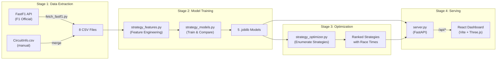
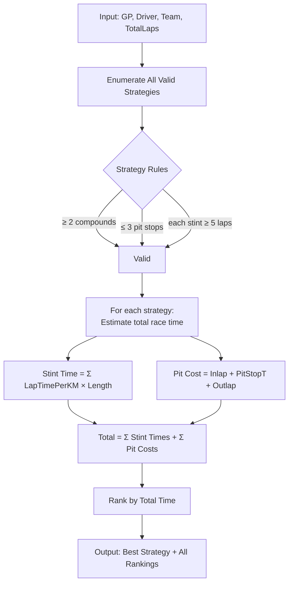

# F1 Tyre Strategy Prediction – Architecture

## Project Overview

An F1 tyre strategy prediction system that uses **FastF1** race data to train **Random Forest** and **Gradient Boosting** models, then finds optimal pit stop strategies via decision-tree enumeration. Served via **FastAPI** backend and a **React + Three.js** dashboard.

---

## Folder Structure

```
f1_tyre_prediction/
├── .agents/skills/         # Claude skill files (ML pipeline guides)
├── f1_strategy/                  # Python ML backend
│   ├── f1pit/              # Python package (PYTHONPATH = model/)
│   │   ├── api/            # FastAPI endpoints (server.py)
│   │   ├── data/           # Data extraction & table building
│   │   ├── features/       # Feature engineering
│   │   ├── models/         # ML models & optimizer
│   │   ├── utils/          # Logging, I/O helpers
│   │   ├── viz/            # Visualization utilities
│   │   └── config.py       # Path configuration
│   ├── tests/              # pytest test suite
│   ├── scripts/            # Shell scripts (e2e runner)
│   ├── notebooks/          # Jupyter notebooks
│   ├── artifacts/          # Trained model files (.joblib)
│   ├── Makefile            # Build/train/serve commands
│   └── requirements.txt    # Python dependencies
├── ui/                     # React + TypeScript frontend
│   ├── src/
│   │   ├── components/     # React UI components
│   │   ├── data/           # Mock data & JSON
│   │   ├── three/          # Three.js 3D rendering
│   │   └── types/          # TypeScript type definitions
│   ├── index.html          # Vite entry point
│   ├── package.json        # Node dependencies
│   └── vite.config.ts      # Vite + API proxy config
├── data/                   # All data files
│   ├── raw/                # Kaggle CSVs, Ergast cache, FastF1 cache
│   ├── processed/          # Output CSVs, parquet files
│   └── CircuitInfo.csv     # Circuit characteristics (Length, Abrasion, etc.)
├── assets/                 # 3D car models (.glb)
├── docs/                   # Documentation, reports, thesis PDF
└── README.md
```

---

## End-to-End Data Flow



---

## ML Models (Detail)

### Model 1: LapTimePerKM (Regression)

| Property | Value |
|----------|-------|
| **Purpose** | Predict normalized lap time (seconds per kilometer) |
| **Algorithm** | Random Forest Regressor vs Gradient Boosting Regressor (auto-selected by MAE) |
| **Training Data** | `DryQuickLaps.csv` — competitive dry laps, 107% rule applied |
| **Target** | `LapTimePerKM` = LapTime / CircuitLength |
| **Numeric Features** | `RacePercentage`, `TyreLife`, `Position`, `Stint` |
| **Categorical Features** | `GP`, `Driver`, `Team`, `Compound` |
| **Train Split** | 2019–2023 |
| **Test Split** | 2024 |
| **RF Hyperparameters** | n_estimators=300, max_depth=15, min_samples_leaf=5 |
| **GB Hyperparameters** | n_estimators=300, lr=0.05, max_depth=5, subsample=0.8 |
| **Output File** | `lap_time_model.joblib` |

### Model 2: PitstopT (Regression)

| Property | Value |
|----------|-------|
| **Purpose** | Predict pit stop duration (pit lane time in seconds) |
| **Algorithm** | Random Forest Regressor vs Gradient Boosting Regressor |
| **Training Data** | `PitstopsWithTeams.csv` — filtered 10–60s range |
| **Target** | `PitstopT` |
| **Features** | `GP` (categorical only) |
| **Output File** | `pitstop_model.joblib` |

### Model 3: Inlap (Regression)

| Property | Value |
|----------|-------|
| **Purpose** | Predict inlap time per km (last lap before pitting) |
| **Algorithm** | Random Forest Regressor vs Gradient Boosting Regressor |
| **Training Data** | `Inlaps.csv` |
| **Target** | `LapTimePerKM` |
| **Numeric Features** | `TyreLife`, `Stint` |
| **Categorical Features** | `GP`, `Compound` |
| **Output File** | `inlap_model.joblib` |

### Model 4: Outlap (Regression)

| Property | Value |
|----------|-------|
| **Purpose** | Predict outlap time per km (first lap on fresh tyres) |
| **Algorithm** | Random Forest Regressor vs Gradient Boosting Regressor |
| **Training Data** | `Outlaps.csv` |
| **Target** | `LapTimePerKM` |
| **Categorical Features** | `GP`, `Compound` |
| **Output File** | `outlap_model.joblib` |

### Model 5: SafetyCar (Binary Classification)

| Property | Value |
|----------|-------|
| **Purpose** | Predict safety car probability per lap |
| **Algorithm** | Random Forest Classifier vs Gradient Boosting Classifier |
| **Training Data** | `SafetyCars.csv` — track status per lap |
| **Target** | `SafetyCar` (1 if SC/VSC, 0 otherwise) |
| **Numeric Features** | `LapNumber` |
| **Categorical Features** | `GP` |
| **Class Balancing** | `balanced_subsample` (RF) |
| **Output File** | `safety_car_model.joblib` |

---

## Strategy Optimizer



### Optimization Modes
| Mode | Description |
|------|-------------|
| **Deterministic** | Pit on exact expected tyre life (S=18, M=28, H=40 laps) |
| **Window** | Test ±3 laps around expected tyre life for each stop |

### Expected Tyre Life (Pirelli estimates)
| Compound | Expected Laps |
|----------|---------------|
| SOFT | 18 |
| MEDIUM | 28 |
| HARD | 40 |

---

## Data Files

### Extracted CSV Files (Stage 1)

| File | Rows (typical) | Key Columns | Used By |
|------|----------------|-------------|---------|
| `DryQuickLaps.csv` | ~50,000 | Driver, Team, LapTime, Compound, TyreLife, LapTimePerKM, RacePercentage | Model 1 |
| `Stints.csv` | ~5,000 | Driver, Stint, Compound, StintLength, GP | Reference |
| `Strategyfull.csv` | ~1,500 | Driver, GP, Year, all compounds used | Reference |
| `Inlaps.csv` | ~3,000 | Driver, LapTime, LapTimePerKM, TyreLife, Compound | Model 3 |
| `Outlaps.csv` | ~3,000 | Driver, LapTime, LapTimePerKM, Compound | Model 4 |
| `PitstopsWithTeams.csv` | ~3,000 | GP, PitstopT, Driver, Team | Model 2 |
| `SafetyCars.csv` | ~6,000 | LapNumber, GP, TrackStatus, Label | Model 5 |
| `NLaps.csv` | ~120 | GP, Year, Laps (total race laps) | Optimizer |

### CircuitInfo.csv
| Column | Example | Description |
|--------|---------|-------------|
| GP | Bahrain | Grand Prix name |
| Length | 5.412 | Circuit length in km |
| Abrasion | 3 | Tyre abrasion level (1-5) |
| Traction | 4 | Traction demand |
| Braking | 3 | Braking severity |
| Lateral | 3 | Lateral load |
| AsphaltAge | 2 | Surface age |

---

## API Endpoints

### Strategy Endpoints (New)
```
GET /api/strategy/optimal?track=Bahrain&driver=VER&team=Red+Bull+Racing&total_laps=57&mode=deterministic
GET /api/strategy/compare?track=Bahrain&total_laps=57
GET /api/safety-car/probability?track=Bahrain&total_laps=57
```

### Legacy Endpoints
```
GET /api/health
GET /api/tracks
GET /api/drivers?track={circuit_id}
GET /api/laps?track={circuit_id}&driver={code}
GET /api/telemetry?track={circuit_id}&driver={code}&lap={n}
GET /api/predictions?track={circuit_id}&driver={code}&lap={n}&compound=medium&conditions=dry
```

---

## Frontend Components

| Component | File | Purpose |
|-----------|------|---------|
| `App.tsx` | Main app shell | Layout, state management, API calls |
| `CarViewer` | 3D Red Bull car | Three.js car model with tyre wear visualization |
| `TrackMap` | 2D circuit overlay | Plotly-based track map with telemetry |
| `TrackMap3D` | 3D circuit view | Three.js 3D track with speed/brake overlays |
| `ControlsBar` | Track/driver/lap selectors | Dropdown controls |
| `KpiPanel` | Key metrics display | Tyre life %, pit window, strategy info |
| `DebugPanel` | Developer overlay | API response inspection |

---

## Tech Stack

| Layer | Technology |
|-------|-----------|
| Data Source | FastF1 (Python library for F1 data) |
| ML Framework | scikit-learn (RandomForest, GradientBoosting) |
| Serialization | joblib (.joblib model files) |
| Backend API | FastAPI + Uvicorn |
| Frontend Framework | React 18 + TypeScript |
| 3D Rendering | Three.js via @react-three/fiber |
| Charts | Plotly.js |
| Build Tool | Vite 5 |
| Styling | Vanilla CSS (F1-themed dark mode) |
| Fonts | Titillium Web, Barlow Condensed |
